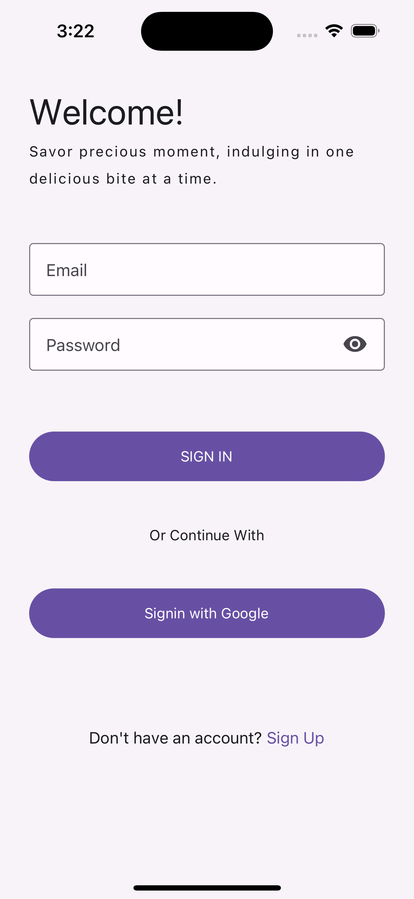
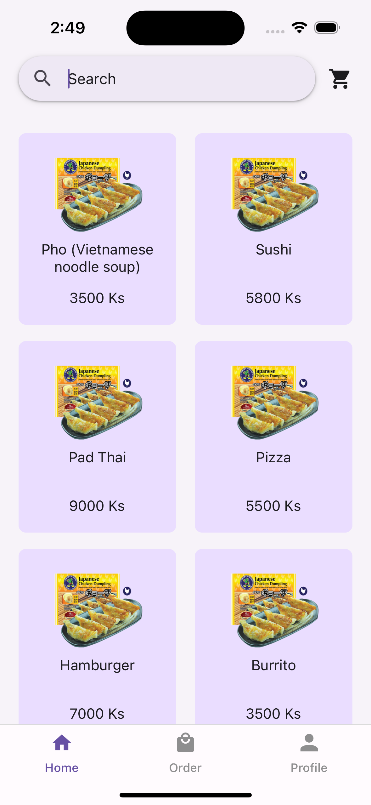
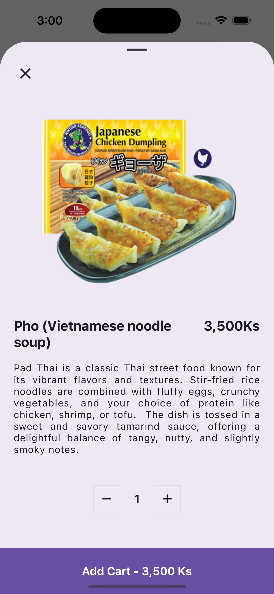
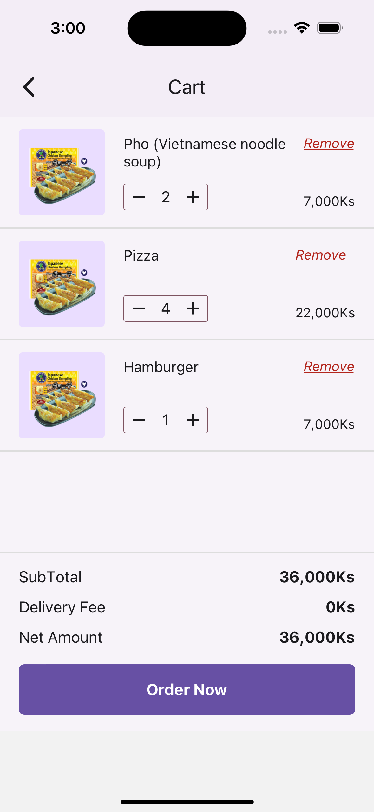

# 🍽️ Food Ordering App

This project is a food ordering application built with React Native using Expo, featuring Supabase authentication. Users can browse a food menu, view details, add items to their cart, and place orders. It also includes features for managing orders and updating user profiles, such as changing profile photos, switching languages, and toggling between dark and light mode.

## ✨ Features

- **🔐 Authentication Flow**:  
  Powered by Supabase, allowing users to securely sign up, log in, and manage their accounts.

- **📋 Dashboard**:  
  Displays a list of food items with prices. Users can view details, add items to their cart 🛒, and place orders.

- **📦 Order Tab**:  
  Keep track of items in the cart and manage current orders.

- **👤 Profile Tab**:  
  Update profile photo, switch between languages 🌍, and toggle dark mode 🌙 or light mode ☀️.

  ## 📸 Screenshots

<p align="center">
  
  
  
  
  
</p>

## 🔧 Tech Stack

- **Supabase**:  
  For authentication and backend services.

- **Expo Router**:  
  Navigation handling for a smooth app experience.

- **React Native Paper**:  
  Beautiful UI components for a consistent design.

- **Zustand**:  
  Lightweight state management for handling user data and cart management.

- **React Hook Form**:  
  Manage form inputs and validation in profile and order management.

- **React Native Reanimated & Gesture Handler**:  
  Smooth animations and gesture-based interactions.

- **Lottie Animations**:  
  For fun, interactive visual feedback to enhance the user experience.

## 🛠️ Installation

1. Clone the repository:
   
   ```bash
   git clone https://github.com/your-repo/food-ordering-app.git
   cd food-ordering-app
3. Install dependencies:
   
   ```bash
   npm install
4. Set up Supabase:
   
   Create a project at supabase.com.
   Configure your Supabase keys for authentication and backend.
   
5. For iOS, generate native code and run the app:
    ```bash
    npx expo run:ios
    ```

6. For Android, generate native code and run the app:
    ```bash
    npx expo run:android
    ```
## 📝 License

This project is licensed under the MIT License.

---

🌟 **Happy Food with FlavorBite!** 🌟
